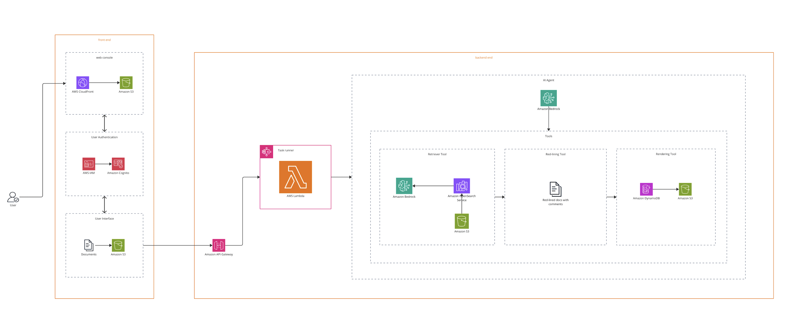

# 📌 One-L Legal AI Document Review System

> _AI-powered legal document analysis platform that automatically identifies conflicts between vendor contract submissions and Massachusetts state requirements._

---

## 🎬 Demo

The system provides a React-based interface with session management, real-time progress tracking, and automated redlined document generation.

> **Key Demo Flow**: Upload vendor contracts → AI analyzes against MA legal requirements → Download redlined documents with conflict annotations

---

## 🧠 What It Does

- 🔍 **Automated Conflict Detection**: AI-powered analysis using Claude 4 Sonnet to identify conflicts between vendor contract language and Massachusetts legal requirements

- 📝 **Intelligent Document Redlining**: Automatically generates marked-up documents highlighting specific conflicts, modifications, and legal issues  
  Creates downloadable redlined versions with detailed conflict annotations and rationale.

- 🏛️ **Massachusetts Legal Compliance**: Specialized knowledge base containing MA state requirements, ITS Terms & Conditions, EOTSS policies, and procurement regulations  
  Uses RAG (Retrieval-Augmented Generation) for accurate legal context and analysis.

- 📊 **Session-Based Workflow**: Organize document reviews into tracked sessions with complete audit trails and historical results  
  Real-time progress tracking via WebSocket integration for long-running AI analysis tasks.

---

## 🧱 Architecture



The system follows a modern serverless microservices architecture on AWS:

```
[React SPA] → [CloudFront CDN] → [API Gateway + WebSocket API] → [Lambda Functions] → [Bedrock AI + Knowledge Base] → [OpenSearch + S3 + DynamoDB]
```

**Key Components:**
- **Frontend**: React SPA with real-time WebSocket integration
- **Authentication**: AWS Cognito with OAuth 2.0 flows
- **AI Engine**: AWS Bedrock with Claude 4 Sonnet and Knowledge Base RAG
- **Storage**: Multi-tier S3 architecture with OpenSearch Serverless vector database
- **Infrastructure**: AWS CDK with modular construct-based deployment

---

## 🧰 Tech Stack

| Layer              | Tools & Frameworks                                           |
|--------------------|--------------------------------------------------------------|
| **Frontend**       | React 18, React Router, Custom WebSocket Service            |
| **Backend**        | AWS Lambda (Python 3.9), API Gateway, WebSocket API        |
| **AI/ML**          | AWS Bedrock (Claude 4 Sonnet), Knowledge Base, Titan Embeddings |
| **Storage**        | S3 (3-tier), DynamoDB, OpenSearch Serverless               |
| **Auth**           | AWS Cognito User Pool, JWT Tokens, OAuth 2.0               |
| **Infra/DevOps**   | AWS CDK (Python), CloudFront, IAM, CloudWatch              |
| **Real-time**      | WebSocket API, Lambda notifications, DynamoDB connections   |

---

## 🧪 Setup

### Prerequisites
- AWS CLI configured with appropriate permissions
- Node.js 18+ for frontend development
- Python 3.9+ for CDK deployment
- AWS CDK v2 installed (`npm install -g aws-cdk`)

### Deployment

```bash
# Clone the repository
git clone https://github.com/The-Burnes-Center/one-L.git
cd one-L

# Set up Python virtual environment
python3 -m venv .venv
source .venv/bin/activate  # On Windows: .venv\Scripts\activate.bat

# Install CDK dependencies
pip install -r requirements.txt

# Configure constants (optional customization)
# Edit constants.py to modify stack name or Cognito domain

# Deploy the infrastructure
cdk bootstrap  # One-time setup per AWS account/region
cdk deploy

# Build and deploy frontend (handled automatically by CDK)
cd one_l/user_interface
npm install
npm run build
```

### Environment Configuration
The system automatically generates runtime configuration post-deployment. No manual `.env` setup required.

---

## 🧠 Core Modules

| Module                          | Description                                                               |
|---------------------------------|---------------------------------------------------------------------------|
| **`one_l_stack.py`**           | Main CDK stack orchestrating all AWS resources with dependency management |
| **`agent_api/agent/agent.py`** | Core AI agent for document analysis using composition design pattern     |
| **`agent_api/agent/model.py`** | Claude 4 Sonnet integration with sophisticated legal prompting        |
| **`agent_api/agent/tools.py`** | Document redlining and DynamoDB operations for analysis results         |
| **`functions/knowledge_management/`** | S3 operations, Knowledge Base sync, and session management      |
| **`functions/websocket/`**     | Real-time communication handlers for progress tracking                   |
| **`user_interface/src/`**      | React frontend with session management and real-time updates            |

---

## 🌍 AI Analysis Flow

The system employs a sophisticated multi-stage AI analysis workflow:

1. 📄 **Document Ingestion** → Upload and session-based organization with automatic S3 storage  
2. 🔍 **Knowledge Base Sync** → Vector embedding and indexing using Titan Text v2  
3. 🧠 **AI Analysis Agent** → Claude 4 Sonnet with 8-15 adaptive queries for complete coverage  
4. ⚖️ **Conflict Detection** → Identifies contradictions, modifications, omissions, and reversals  
5. 📝 **Document Redlining** → Generates marked-up documents with detailed conflict annotations  
6. 💾 **Results Storage** → Structured conflict data saved to DynamoDB with session tracking

---

## 🛡️ Security & Privacy

- **Zero Trust Architecture**: Every service interaction requires authentication and authorization
- **End-to-End Encryption**: Data encrypted in transit (TLS) and at rest (S3/DynamoDB encryption)
- **Fine-Grained IAM**: Least privilege access with service-specific roles and policies
- **User Authentication**: AWS Cognito with strong password policies and JWT token management
- **Audit Trail**: Complete session tracking and analysis history for compliance
- **No Data Retention**: Documents processed securely with configurable retention policies

---

## 📖 Documentation

### Implementation Playbook
**[Complete Implementation Guide](https://docs.google.com/document/d/1TGCLBY8JlsL46_5L6Bnm4dIeTpoVE3Ec/edit?usp=sharing&ouid=117647832595317958025&rtpof=true&sd=trued)** - Contains all required information for setup, deployment, and configuration.

| Guide | Description |
|-------|-------------|
| **[Deployment Guide](./docs/DEPLOYMENT.md)** | Step-by-step infrastructure deployment |
| **[Architecture Overview](./docs/ARCHITECTURE.md)** | Technical system architecture details |
| **[API Documentation](./docs/API.md)** | REST and WebSocket API reference |

### Development Commands

| Command | Description |
|---------|-------------|
| `cdk ls` | List all stacks in the app |
| `cdk synth` | Synthesize CloudFormation template |
| `cdk deploy` | Deploy infrastructure to AWS |
| `cdk diff` | Compare deployed stack with current state |
| `cdk destroy` | Remove all AWS resources |
| `npm run start` | Run React frontend locally (from user_interface/) |

---

## 🤝 Contributing

Pull requests are welcome. For major changes, please open an issue first.

---

## 📄 License

MIT License – see `LICENSE` for details.

---

## 👥 Authors & Acknowledgements

- Built by [Ritik Bompilwar](https://www.linkedin.com/in/ritik-bompilwar) and Divya Hegde
- Developed for AI4Impact initiative  
- Powered by AWS serverless technologies

