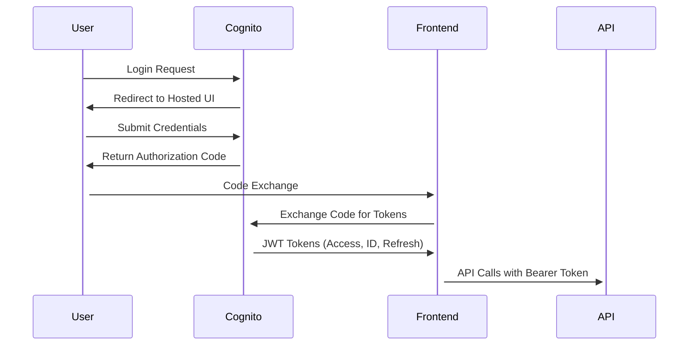
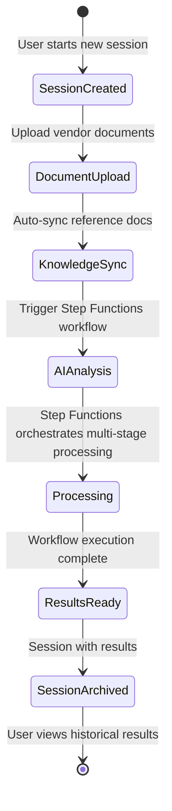

# One-L System Architecture

## System Overview

One-L is a serverless, cloud-native legal document analysis platform built on AWS. The system uses **AWS Step Functions** to orchestrate a multi-stage workflow that leverages cutting-edge AI services to automatically identify conflicts between vendor contract submissions and Massachusetts state legal requirements.

**Core Architecture Pattern**: All document analysis operations are orchestrated by a Step Functions state machine that coordinates 12 Lambda functions across 11 distinct stages, ensuring reliable, scalable, and maintainable processing.

## Architecture Principles

### **Serverless-First Design**
- Zero server management overhead
- Automatic scaling based on demand
- Pay-per-use cost model
- Built-in high availability

### **Microservices Architecture**
- Loosely coupled, independently deployable services
- Single responsibility principle for each Lambda function
- Event-driven communication patterns
- Service composition through dependency injection

### **Security by Design**
- Zero-trust architecture with authentication at every layer
- Fine-grained IAM permissions with least privilege
- End-to-end encryption for data in transit and at rest
- Comprehensive audit trails

### **Infrastructure as Code**
- Complete AWS CDK-based deployment
- Modular, reusable construct patterns
- Version-controlled infrastructure
- Automated dependency management

## System Components

### **Frontend Layer**

#### **React Single Page Application**
- **Technology**: React 18 with functional components and hooks
- **Hosting**: S3 static website with CloudFront CDN
- **Features**:
  - Session-based document management
  - Real-time progress tracking
  - Responsive design with mobile support
  - Comprehensive error handling

#### **Key Frontend Components**
```
src/
├── App.js                 # Main application router and state management
├── components/
│   ├── SessionSidebar.js  # Session navigation and management
│   ├── FileUpload.js      # Document upload interface
│   ├── VendorSubmission.js # Vendor-specific upload workflow
│   ├── AdminDashboard.js  # Knowledge base administration
│   └── UserHeader.js      # Authentication and user management
├── services/
│   ├── api.js            # REST API client with error handling
│   ├── auth.js           # Cognito authentication service
│   └── websocket.js      # Real-time WebSocket client
└── utils/
    └── config.js         # Dynamic configuration loading
```

### **Authentication & Authorization**

#### **AWS Cognito User Pool**
- **User Management**: Email/password authentication with social login support
- **Token Management**: JWT tokens with automatic refresh
- **Security Features**:
  - Strong password policies (8+ chars, mixed case, numbers, symbols)
  - Email verification required
  - Session timeout configuration
  - Account recovery via email

#### **Authorization Flow**


### **API Layer**

#### **API Gateway (REST)**
- **Function**: Routes HTTP requests to appropriate Lambda functions
- **Features**:
  - CORS-enabled for cross-origin requests
  - Request/response transformation
  - Throttling and rate limiting
  - Integration with AWS WAF for security

#### **WebSocket API**
- **Function**: Real-time bidirectional communication
- **Use Cases**:
  - Document processing progress updates
  - Job completion notifications
  - Connection health monitoring
- **Connection Management**: DynamoDB-backed persistent connections

### **Compute Layer (AWS Lambda + Step Functions)**

#### **Knowledge Management Functions**

**Upload to S3 Function**
- **Purpose**: Generate presigned URLs for secure client-side uploads
- **Pattern**: Direct S3 upload to minimize Lambda processing time
- **Security**: Validates file types and sizes before URL generation

**Retrieve from S3 Function**
- **Purpose**: Secure file downloads with access control
- **Features**: Base64 encoding for binary files, metadata retrieval
- **Optimization**: Streaming for large files

**Knowledge Base Sync Function**
- **Purpose**: Triggers vector indexing after document uploads
- **Integration**: AWS Bedrock Knowledge Base for automatic ingestion
- **Event-Driven**: S3 event notifications trigger automatic sync

**Session Management Function**
- **Purpose**: CRUD operations for user sessions
- **Database**: DynamoDB for session metadata and tracking
- **Features**: Session-based file organization, result tracking

#### **Step Functions Workflow (Document Review)**

**Step Functions State Machine**
- **Purpose**: Orchestrates multi-stage AI document analysis workflow
- **Pattern**: Serverless workflow with parallel processing and error handling
- **Features**:
  - Long-running workflow support (up to 2 hours)
  - Automatic retries and error recovery
  - Progress tracking via DynamoDB and WebSocket notifications
  - Parallel chunk processing for large documents

**Workflow Stages**:
```
Initialize Job → Split Document → Analyze Chunks (Parallel) → Merge Results → Generate Redline → Save Results → Cleanup
```

**Step Functions Lambda Functions**:
- **InitializeJob**: Sets up job tracking in DynamoDB
- **SplitDocument**: Chunks documents for parallel processing
- **AnalyzeStructure**: Analyzes document structure and generates KB queries
- **RetrieveAllKBQueries**: Retrieves knowledge base context for all queries
- **IdentifyConflicts**: Detects conflicts using Claude 4 Sonnet with RAG context
- **MergeChunkResults**: Combines results from parallel chunk processing
- **GenerateRedline**: Creates redlined document with conflict annotations
- **SaveResults**: Stores final results in DynamoDB
- **CleanupSession**: Removes temporary processing files
- **HandleError**: Centralized error handling and cleanup
- **StartWorkflow**: Entry point Lambda that starts Step Functions execution
- **JobStatus**: Polling endpoint for job status and progress

**Step Functions State Machine Definition**:
```json
{
  "Comment": "Document Review Workflow",
  "StartAt": "InitializeJob",
  "States": {
    "InitializeJob": {
      "Type": "Task",
      "Resource": "arn:aws:states:::lambda:invoke",
      "Next": "SplitDocument"
    },
    "SplitDocument": {
      "Type": "Task",
      "Resource": "arn:aws:states:::lambda:invoke",
      "Next": "AnalyzeStructure"
    },
    "AnalyzeStructure": {
      "Type": "Task",
      "Resource": "arn:aws:states:::lambda:invoke",
      "Next": "RetrieveKBQueries"
    },
    "RetrieveKBQueries": {
      "Type": "Task",
      "Resource": "arn:aws:states:::lambda:invoke",
      "Next": "IdentifyConflicts"
    },
    "IdentifyConflicts": {
      "Type": "Map",
      "ItemsPath": "$.chunks",
      "MaxConcurrency": 5,
      "Iterator": {
        "StartAt": "ProcessChunk",
        "States": {
          "ProcessChunk": {
            "Type": "Task",
            "Resource": "arn:aws:states:::lambda:invoke",
            "End": true
          }
        }
      },
      "Next": "MergeChunkResults"
    },
    "MergeChunkResults": {
      "Type": "Task",
      "Resource": "arn:aws:states:::lambda:invoke",
      "Next": "GenerateRedline"
    },
    "GenerateRedline": {
      "Type": "Task",
      "Resource": "arn:aws:states:::lambda:invoke",
      "Next": "SaveResults"
    },
    "SaveResults": {
      "Type": "Task",
      "Resource": "arn:aws:states:::lambda:invoke",
      "Next": "CleanupSession"
    },
    "CleanupSession": {
      "Type": "Task",
      "Resource": "arn:aws:states:::lambda:invoke",
      "End": true
    },
    "HandleError": {
      "Type": "Task",
      "Resource": "arn:aws:states:::lambda:invoke",
      "End": true
    }
  },
  "Retry": [
    {
      "ErrorEquals": ["States.ALL"],
      "IntervalSeconds": 2,
      "MaxAttempts": 3,
      "BackoffRate": 2.0
    }
  ],
  "Catch": [
    {
      "ErrorEquals": ["States.ALL"],
      "Next": "HandleError"
    }
  ]
}
```

**Key Step Functions Features**:
- **Error Handling**: Automatic retries with exponential backoff
- **Parallel Processing**: Map state for concurrent chunk analysis
- **State Management**: Passes data between Lambda functions via JSON
- **Progress Tracking**: Updates DynamoDB at each stage
- **WebSocket Notifications**: Sends progress updates to connected clients
- **Timeout Management**: 2-hour maximum execution time
- **Cost Optimization**: Pay only for state transitions, not idle time

#### **WebSocket Functions**

**Connect/Disconnect Handlers**
- **Purpose**: Manage WebSocket connection lifecycle
- **Storage**: DynamoDB for connection state tracking
- **Authentication**: JWT token validation on connection

**Message Handler**
- **Purpose**: Route incoming WebSocket messages
- **Features**: Subscription management for job/session updates
- **Patterns**: Pub/sub for real-time notifications

### **AI/ML Services**

#### **AWS Bedrock Integration**

**Claude 4 Sonnet Model**
- **Use Case**: Primary analysis engine for legal document review
- **Capabilities**:
  - Advanced reasoning for complex legal language
  - Context-aware conflict detection
  - Structured output generation

**Advanced Prompting System**
- **Methodology**: 8-15 distinct, non-overlapping queries
- **Approach**: Adaptive to vendor document structure
- **Coverage**: Comprehensive analysis of all document sections

```python
# Example: Sophisticated prompt engineering
SYSTEM_PROMPT = """
You are a Legal-AI Contract Analysis Assistant...
## CRITICAL METHODOLOGY: DOCUMENT STRUCTURE-DRIVEN ANALYSIS
...
### STEP 1: ANALYZE VENDOR DOCUMENT STRUCTURE
### STEP 2: INTELLIGENT STRUCTURE-BASED QUERYING
### STEP 3: COMPREHENSIVE CONFLICT DETECTION
### STEP 4: SYSTEMATIC VERIFICATION
"""
```

#### **RAG (Retrieval-Augmented Generation) System**

**AWS Bedrock Knowledge Base**
- **Vector Database**: OpenSearch Serverless for semantic search
- **Embeddings**: Amazon Titan Text v2 for high-quality vector representations
- **Data Sources**: Multiple S3 buckets with automatic synchronization

**Knowledge Base Architecture**:
```
Reference Documents (S3) → Chunking (300 tokens, 20% overlap) → Embeddings (Titan) → Vector Index (OpenSearch) → RAG Context
```

### **Storage Layer**

#### **Amazon S3 (3-Tier Architecture)**

**Knowledge Bucket**
- **Purpose**: Reference documents, legal templates, MA state requirements
- **Access Pattern**: Read-heavy for AI analysis context
- **Organization**: Admin-managed with version control

**User Documents Bucket**
- **Purpose**: Vendor submissions and user uploads
- **Organization**: Session-based folder structure
- **Features**: Automatic lifecycle policies, event notifications

**Agent Processing Bucket**
- **Purpose**: AI analysis results, redlined documents, temporary processing files
- **Access Pattern**: Write-heavy during processing, read-heavy for downloads
- **Security**: Strict access controls for sensitive analysis data

#### **DynamoDB Tables**

**Analysis Results Table**
```
Partition Key: analysis_id
Sort Key: timestamp
Attributes: document_s3_key, conflicts, analysis_data, usage_metrics
GSI: document-index (document_s3_key, timestamp)
```

**Sessions Table**
```
Partition Key: session_id
Sort Key: user_id
Attributes: title, created_at, updated_at, has_results, status
GSI: user-index (user_id, created_at)
```

**WebSocket Connections Table**
```
Partition Key: connection_id
Sort Key: user_id
Attributes: connected_at, subscribed_job_id, session_id, ttl
GSI: user-index (user_id, connected_at)
```

#### **OpenSearch Serverless**
- **Purpose**: Vector database for semantic search and AI context retrieval
- **Index Structure**: Knowledge-base-index with vector, text, and metadata fields
- **Security**: Collection-level access policies with encryption

### **Infrastructure as Code (AWS CDK)**

#### **Modular Construct Design**

```python
# Main stack orchestration
class OneLStack(Stack):
    def __init__(self, scope, construct_id, **kwargs):
        # Dependency-managed construct creation
        self.authorization = AuthorizationConstruct(...)
        self.agent_api = AgentApiConstruct(...)
        self.api_gateway = ApiGatewayConstruct(...)
        self.user_interface = UserInterfaceConstruct(...)
```

#### **Construct Hierarchy**
```
OneLStack
├── AuthorizationConstruct (Cognito + Auth Lambda)
├── AgentApiConstruct
│   ├── StorageConstruct (S3 + DynamoDB)
│   ├── OpenSearchConstruct (Serverless collection)
│   ├── KnowledgeBaseConstruct (Bedrock integration)
│   └── FunctionsConstruct
│       ├── KnowledgeManagementConstruct
│       ├── AgentConstruct (Step Functions + Lambda Functions)
│       └── WebSocketConstruct
├── ApiGatewayConstruct (REST + WebSocket APIs)
└── UserInterfaceConstruct (React app + CloudFront)
```

## Data Flow Architecture

### **Document Analysis Workflow (Step Functions Orchestration)**

The entire document analysis process is orchestrated by a **Step Functions state machine** that coordinates 12 Lambda functions across 11 stages:

1. **Upload Phase**
   ```
   User → Frontend → API Gateway → Upload Lambda → S3 Presigned URL → Direct S3 Upload
   ```

2. **Knowledge Base Sync (Automatic)**
   ```
   S3 Event → Knowledge Base Sync Lambda → Bedrock Ingestion → Vector Indexing
   ```

3. **Step Functions Workflow Initiation**
   ```
   User Request → API Gateway → StartWorkflow Lambda → Step Functions State Machine Started
   ```

4. **Step Functions Orchestrated Analysis (11 Stages)**
   ```
   Step Functions State Machine:
   ├── InitializeJob → Sets up job tracking
   ├── SplitDocument → Chunks document for parallel processing
   ├── AnalyzeStructure → Analyzes structure, generates KB queries
   ├── RetrieveAllKBQueries → Retrieves knowledge base context
   ├── IdentifyConflicts (Map State) → Parallel chunk analysis with Claude 4 Sonnet
   ├── MergeChunkResults → Combines parallel results
   ├── GenerateRedline → Creates redlined document
   ├── SaveResults → Stores results in DynamoDB
   └── CleanupSession → Removes temporary files
   ```

5. **Real-time Progress Updates**
   ```
   Step Functions Progress → Lambda Updates DynamoDB → WebSocket API → Connected Clients → UI Updates
   ```

6. **Completion Notification**
   ```
   Step Functions Complete → SaveResults Lambda → DynamoDB + S3 → WebSocket Notification → User Sees Results
   ```

### **Session Management Flow**



## Security Architecture

### **Zero Trust Model**
- Every service interaction requires authentication
- No implicit trust between services
- Network segmentation with VPC endpoints (where applicable)

### **Authentication Flow**
```
User → Cognito (JWT) → API Gateway (Authorizer) → Lambda (Token Validation) → AWS Services (IAM Roles)
```

### **Encryption Strategy**
- **In Transit**: TLS 1.2+ for all communications
- **At Rest**: S3 SSE-S3, DynamoDB encryption, OpenSearch encryption
- **Application**: JWT tokens with short expiration

### **IAM Strategy**
```python
# Example: Least privilege role creation
def create_s3_read_role(self, role_name: str, buckets: List[s3.Bucket]):
    role = iam.Role(
        scope, role_name,
        assumed_by=iam.ServicePrincipal("lambda.amazonaws.com"),
        managed_policies=[
            iam.ManagedPolicy.from_aws_managed_policy_name(
                "service-role/AWSLambdaBasicExecutionRole"
            )
        ]
    )
    # Grant minimal required permissions
    for bucket in buckets:
        bucket.grant_read(role)
    return role
```

## Performance and Scalability

### **Auto-Scaling Characteristics**
- **Lambda**: Automatic scaling up to 10,000 concurrent executions
- **API Gateway**: Handles 10,000 requests per second by default
- **DynamoDB**: On-demand billing mode with automatic scaling
- **OpenSearch Serverless**: Managed scaling based on usage

### **Performance Optimizations**
- **Cold Start Mitigation**: Minimal dependencies in Lambda functions
- **Connection Pooling**: Reuse database connections across invocations
- **Caching Strategy**: CloudFront CDN for static assets, API response caching
- **Async Processing**: Step Functions orchestrates long-running AI tasks (up to 2 hours)
- **Parallel Processing**: Step Functions Map state for concurrent chunk analysis
- **Error Recovery**: Step Functions automatic retries with exponential backoff

### **Monitoring and Observability**
- **CloudWatch**: Comprehensive metrics and logging
- **X-Ray**: Distributed tracing for request flow analysis
- **Custom Metrics**: Business metrics for document processing success rates
- **Alarms**: Proactive alerting for system health

## Disaster Recovery and Business Continuity

### **Backup Strategy**
- **DynamoDB**: Point-in-time recovery enabled
- **S3**: Cross-region replication for critical data
- **Infrastructure**: CDK code in version control for rapid redeployment

### **Recovery Procedures**
- **RTO (Recovery Time Objective)**: < 4 hours for full system recovery
- **RPO (Recovery Point Objective)**: < 1 hour for data loss tolerance
- **Multi-Region**: Infrastructure code supports multi-region deployment

This architecture provides a robust, scalable, and secure foundation for legal document analysis with enterprise-grade capabilities.
